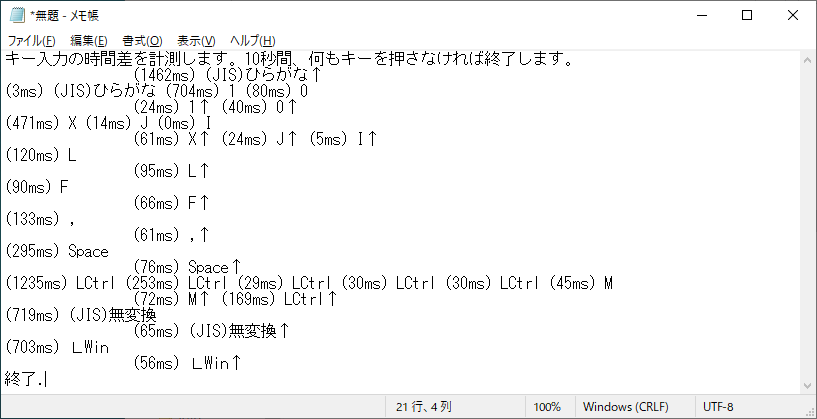

# キー入力の時間差を計測する (Windows)

## KeyTimingChecker.ahk

Autohotkeyから実行し、開かれたメモ帳でキーを押すと、キーの名前と時間差が出力されます。

開いたメモ帳以外のウインドウでキー入力すると終了します。

できるだけ多くのキーに対応しました。(104英語キーボード、109日本語キーボードドライバ使用時)

## 仕様

* キーボードドライバを通じてキーの上げ下げを取得し、同時に表示もしているので時間差にはぶれがあります。

* 同時押しで名前が変わるキーがあります。

例：Alt+PrintScreen、Ctrl+Pause

* スリープ系のキーには対応しません。また、ドライバが認識できない機能キーには対応できません。

例：PC-9801キーボードドライバ使用時は、(Mac)英数、(Mac)かな、右Alt、F13〜F24を認識しません。

* 次のキーを押すのは勧めません。

1. Win+L

* EXE化して実行し一度に大量のキーを押すと、ウイルス対策ソフトにキーロガーか何かと間違えられることがあります。

## 動作確認

* Windows 10 Home version 20H2 + AutoHotkey (v1.1.33.02)
