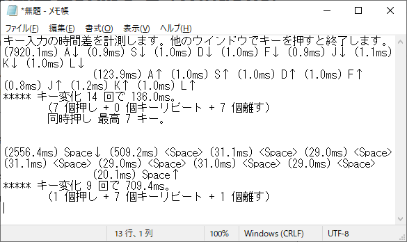

# キー入力の時間差を計測する (Windows)
## KeyTimingChecker.ahk
__Autohotkey.exe にドラッグするなどして実行します。__  
開かれたメモ帳でキーを押し、キーから手を離して 1.05 秒経つとキーの名前と時間差が出力されます。

他のウインドウでキー入力すると終了します。  
できるだけ多くのキーに対応しました。(104英語キーボード、109日本語キーボードドライバ使用時)
## 仕様
* 同時押しで名前が変わるキーがあります。  
例：`Alt+PrintScreen`、`Ctrl+Pause`
* スリープ系のキーには対応しません。また、ドライバが認識できない機能キーには対応できません。  
例：PC-9801キーボードドライバ使用時は、`(Mac)英数`、`(Mac)かな`、`右Alt`、`F13`〜`F24`を認識しません。
* 次のキーには対応していません。  
`Win+L`、`Ctrl+Alt+Del`
* EXE化したスクリプトを実行して、
一度に大量のキーを押すとウイルス対策ソフトが反応することがあるので、
動かないようにしています。
## 動作確認
* Windows 10 Home version 20H2 + AutoHotkey (v1.1.34.03)
