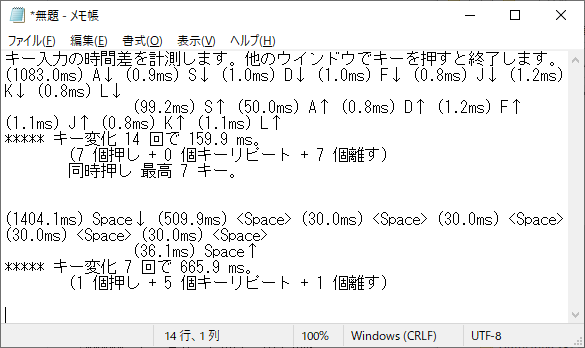

# キー入力の時間差を計測する (Windows)
## KeyTimingChecker.ahk
Autohotkey.exe にドラッグするなどして実行します。  
開かれたメモ帳でキーを押し、キーから手を離して 1.05 秒経つとキーの名前と時間差が出力されます。

開いたメモ帳以外のウインドウでキー入力すると終了します。

できるだけ多くのキーに対応しました。(104英語キーボード、109日本語キーボードドライバ使用時)

## 仕様
* 同時押しで名前が変わるキーがあります。  
例：Alt+PrintScreen、Ctrl+Pause
* スリープ系のキーには対応しません。また、ドライバが認識できない機能キーには対応できません。  
例：PC-9801キーボードドライバ使用時は、(Mac)英数、(Mac)かな、右Alt、F13〜F24を認識しません。
* 次のキーには対応していません。
1. Win+L
1. Ctrl+Alt+Del
* EXE化したスクリプトを実行して一度に大量のキーを押すと、
ウイルス対策ソフトが反応することがあるので動作しません
## 動作確認
* Windows 10 Home version 20H2 + AutoHotkey (v1.1.34.03)
